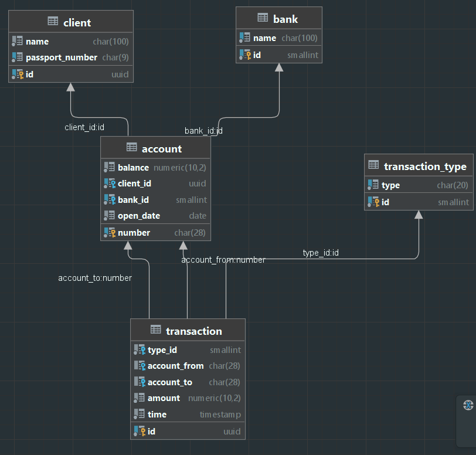

Clever-Bank
============

    Банковское приложение (консольное / веб).
    Доступные функции:
    
        - пополнение счета
        - снятие денежных средст со счета
        - перевод денег со счета на счет
        - генерация чека в формате pdf
        - генерация выписки по операциям за конкретный период времени
    
    Используемые технологии:
    
            Основными требованиями к проекту были запрет использования Spring и Hibernate, 
    а также обязательное использование JDBC.

            В связи с этим, были использованы:
        
        - JDK 17
        - для сборки проекта - Gradle
        - для взаимодействия с БД - JDBC
        - БД - PostgreSQL
        - в качестве datasource - s3p0
        - для генерации pdf - itextpdf
        - веб часть приложения написана с использованием jakarta.servlet, tomcat 10.1.13
        - для валидации - jakarta.validation, org.apache.bval
        - для реализации АОП функций - AspectJ
        - иные библиотеки

Для приложения была использована следующая схема БД:
--------------------------------------------------
    

Консольная версия
-----

Консольная версия приложения имеет ограниченный функционал. 

В частности, доступны только функции пополнения баланса / снятия денежных средств, перевод  
денег между счетами, генерация чека, логирование входных / выходных параметров сервисных методов. 

Для запуска консольной версии необходимо:  
    - клонировать репозиторий, 
    - в PostgreSQL создать базу данных 'CleverBank',  
    - создать необходимые таблицы,  
    - заполнить их дефолтными значениями. 
Приложение ожидает, что вышеуказанные операции уже будут выполнены.  
Для генерации таблиц и заполнения их дефолтными значениями можно использовать sql файл, 
находящийся в пакете resources/sql.  
Для подключения к БД приложение будет использовать логин - postgres, пароль - postgres.  

После настройки БД необходимо скомпилировать проект и запустить метод main,  
находящийся в классе src.main.java.by.home.Main.  
Приложение ожидает, что ему будут переданы аргументы коммандной строки.  
Должно были 2 или 3 аргумента, разделенные одним пробелом.
    
Возможные варианты аргументов:

    account amount

где параметр account должен соответствовать паттерну "^BY13[A-Z]{4}\d{20}$" - банковский счет, 
с которым будет производиться операция (пополнение / снятие);  
amount - сумма операции (не более 8 значащих чисел и двух чисел в дробной части). 
Пример валидного счета - "BY13CLVR00000000000000000000", валидной суммы - "1000.55".  
Банковский счет обязательно должен находиться в БД.  
Уже добавленные счета можно взять из sql файла.  
Сумма допускает как положительные значения, так и отрицательные.  
При передаче положительного значения будет произведено зачисление денег,  
при передаче отрицательного - снятие.  
Снятие невозможно, если на счете недостаточно для операции средств.

    account1 account2 amount

где параметр account1 - счет, с которого будет произведено снятие денежные средств, 
account2 - счет, на который будет произведено зачисление,  
amount - сумма операции (не более 8 значащих чисел и двух чисел в дробной части).  
Счета должны соответствовать паттерну "^BY13[A-Z]{4}\d{20}$".  
Пример валидного счета - "BY13CLVR00000000000000000000", валидной суммы - "1000.55".  
Банковские счета обязательно должены находиться в БД.  
Уже добавленные счета можно взять из sql файла.  
Сумма допускает только положительные значения.  
Перевод невозможен, если на первом счете недостаточно для операции средств. 

При успешном выполнении операции в консоль будет выведено сообщение "Operation successful complete". 
Одновременно с этим, в папку check в корне проекта будет помещен pdf файл с чеком проведенной операции. 
В файл logging.txt в корне проекта будет добавлена информация о вызовах сервисных методов. 

Веб версия
-------------------------------

В веб версии доступен весь функционал, доступный в консольной версии приложения.  

Кроме того, есть возможность воспользоваться дополнительными функциями,  
такими как получение сокращенной или подробной выписки по операциям  
за определенный период времени по определенному счету. 
Кроме того, в автоматическом режиме работает функция начисления процентов на остаток средств на счете.  
Начисление происходит в последний день каждого месяца, значение берется из property файла. 
Дефолтное значение - 1. 

Для запуска веб версии приложения необходимо клонировать репозиторий,  
после чего из консоли выполнить комманду 
    
    docker compose up

Для ее выполнения необходимо, чтобы была установлен Docker. 
После ввода данной команды будет поднят контейнер со всем необходимым для работы приложения. 

Для взаимодействия с базой данных можно воспользовать веб интерфейсом pgadmin. 
Доступ к нему осуществляется по адресу: <a href="http://localhost:82"> перейти к pgadmin</a>  
В качестве логина установлено значение - "mymail@mail.ru", в качестве пароля - "secretPassword"  
Логин для доступа к БД - "postgres", пароль - "postgres".

Приложение доступно по адресу: <a href="http://localhost:8082/clever-bank"> http://localhost:8082/clever-bank/ </a>  
Для взаимодействия с приложением доступны следующие эндпоинты  
(все указанные ниже адреса должны продолжать адрес приложения):

> POST /accounts/changeBalance?account=value&amount=value

Параметры account и amount являются обязательными, могут быть указаны в произвольном порядке.  
Account должен соответствовать паттерну "^BY13[A-Z]{4}\d{20}$" - банковский счет,  
с которым будет производиться операция(пополнение / снятие); 
amount - сумма операции (не более 8 значащих чисел и двух чисел в дробной части). 

Банковский счет обязательно должен находиться в БД.  
Уже добавленные счета можно взять из sql файла.  
Сумма допускает как положительные значения, так и отрицательные.  
При передаче положительного значения будет произведено зачисление денег,  
при передаче отрицательного - снятие.  
Снятие невозможно, если на счете недостаточно для операции средств.  

пример запроса: 
`http://localhost:8082/clever-bank/accounts/changeBalance?account=BY13CLVR00000000000000000000&amount=1000

> POST /accounts/transferMoney?account_from=value&account_to=value&amount=value

где параметр account_from - счет, с которого будет произведено снятие денежные средств,  
account_to - счет, на который будет произведено зачисление,  
amount - сумма операции (не более 8 значащих чисел и двух чисел в дробной части).  

Счета должны соответствовать паттерну "^BY13[A-Z]{4}\d{20}$".  
Банковские счета обязательно должены находиться в БД.  
Уже добавленные счета можно взять из sql файла.  
Сумма допускает только положительные значения.  
Перевод невозможен, если на первом счете недостаточно для операции средств. 

пример запроса:
`http://localhost:8082/clever-bank/accounts/transferMoney?account_from=BY13CLVR00000000000000000000&amount=1000&account_to=BY13CLVR00000000000000000001

> GET /transactions/statement?account=value&dateFrom=value&dateTo=value&detailed=value

где только параметр account является обязательным, остальные опциональные. 

Account должен соответствовать паттерну "^BY13[A-Z]{4}\d{20}$" - банковский счет,  
для которого будет сгенерирована выписка.  
Банковский счет обязательно должен находиться в БД.  
Уже добавленные счета можно взять из sql файла.  

Параметр detailed допускает boolean значения true / false.  
При передаче значения true будет сгенерирована подробная выписка,  
при передаче значения false будет сгенерирована общая выписка.  
Если параметр не будет передан, выбирается значение false.  

Параметры dateFrom и dateTo определяют временной промежуток,  
для которого будет генерироваться выписка.  
dateFrom - дата, с которой будут включаться транзакции в выписку,  
dateTo - дата, по которую включительно будут включаться транзакции в выписку.  
Оба параметра могут не передаваться.  
Дефолтное значение dateFrom - дата открытия счета, для которого формируется выписка, 
dateTo - дата формирования выписки.  
Обе даты должны соответствовать виду "2023-01-01".  

пример запроса:
`http://localhost:8082/clever-bank/transactions/statement?account=BY13CLVR00000000000000000001&dateFrom=2023-01-01&dateTo=2023-01-01&detailed=true

Если операция была выполнена успешно, будет возвращен код ответа 200 и сообщение "Operation successful complete". 
При некорректных входных параметрах будет возвращен код ответа 400 и сообщение о проблеме. 
Для операций, изменяющий баланс счета в папку check будет помещен pdf файл с чеком о проведенной операции.  
В файл logging.txt будет добавлена информация о вызовах сервисных методов.  
По всем операциям осуществляется логирование вызовов сервисных методов.

pdf файлы и файл логирования можно найти в Docker контейнере в файловой системе tomcat по пути: /usr/local/tomcat. 
Чеки хранятся в папке /check, 
выписки в папке /statement-money, 
логи в файле logging.txt 
Обратите внимание, что при просмотре pdf файлов через Docker возможнЫ проблемы с кодировкой.  
Во избежание этой проблемы pdf файлы необходимо сохранить на устройство.  

По всем возникшим вопросам можно писать по адресу maxamus_747@mail.ru 